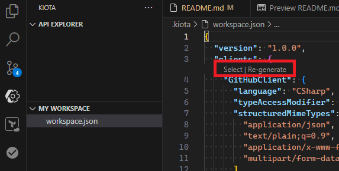

# Bank API 🏦

[![CC BY-NC-SA 4.0][cc-by-nc-sa-shield]][cc-by-nc-sa]


The Bank API is a design reference project suitable to bootstrap development for a compliant and modern API.

## Compliance

The API complies to:

- [OWASP API Security Top 10 - v2023](https://owasp.org/API-Security/editions/2023/en/0x11-t10/) via [Spectral OWASP API Security](https://github.com/stoplightio/spectral-owasp-ruleset?tab=readme-ov-file#spectral-owasp-api-security)

- [OpenAPI Specification v3.0.1](https://spec.openapis.org/oas/v3.0.1.html) via [Spectral "oas" ruleset](https://docs.stoplight.io/docs/spectral/4dec24461f3af-open-api-rules)

- Additional naming conventions, structure, and clarity via [Bank ruleset](.spectral/ruleset.bank.yml)

- [California Consumer Privacy Act (CCPA)](https://oag.ca.gov/privacy/ccpa) and [General Data Protection Regulation (GDPR)](https://europa.eu/youreurope/business/dealing-with-customers/data-protection/data-protection-gdpr/index_en.htm#:~:text=The%20GDPR%20sets%20out%20detailed,people%20living%20in%20the%20EU.) via [ASP.Net Core Compliance](https://andrewlock.net/redacting-sensitive-data-with-microsoft-extensions-compliance/)

## Technology stack

- [ASP.NET Core 9.0 - Minimal API](https://learn.microsoft.com/en-us/aspnet/core/fundamentals/minimal-apis/overview?view=aspnetcore-9.0) for API development, with following base services:

  - [Resilience](https://learn.microsoft.com/en-us/dotnet/core/resilience/http-resilience?tabs=package-reference) for resilience when calling downstream APIs

  - [Compliance](https://andrewlock.net/redacting-sensitive-data-with-microsoft-extensions-compliance/) for redacting sensitive data

  - [Health checks](https://learn.microsoft.com/en-us/aspnet/core/host-and-deploy/health-checks?view=aspnetcore-9.0) for checking health status

  - [Service Discovery](https://learn.microsoft.com/en-us/dotnet/core/extensions/service-discovery?tabs=package-reference) for resolving endpoints from config

  - [Hybrid Cache](https://learn.microsoft.com/en-us/aspnet/core/performance/caching/hybrid?view=aspnetcore-9.0) for caching

  - [Rate limiting](https://learn.microsoft.com/en-us/aspnet/core/performance/rate-limit?view=aspnetcore-9.0) for rate limiting

  - [API Key, JWT bearer and OpenID Connection-based authentication](https://learn.microsoft.com/en-us/aspnet/core/fundamentals/minimal-apis/security?view=aspnetcore-9.0#configuring-authentication-strategy) for security

  - [OpenApi](https://learn.microsoft.com/en-us/aspnet/core/fundamentals/openapi/aspnetcore-openapi?view=aspnetcore-9.0&tabs=visual-studio) for generating OpenAPI specifications

  - [Cross-Origin Resource Sharing (CORS)](https://learn.microsoft.com/en-us/aspnet/core/security/cors?view=aspnetcore-9.0) for cross-origin requests

- [OpenTelemetry (OTel)](https://learn.microsoft.com/en-us/dotnet/core/diagnostics/observability-with-otel) for observability

- [.NET Aspire](https://learn.microsoft.com/en-us/dotnet/aspire/get-started/aspire-overview) for development bootstrapping and client integrations

- [Kiota API client generation](https://learn.microsoft.com/en-us/openapi/kiota/using#client-generation) for calling downstream APIs

- [Gridify](https://alirezanet.github.io/Gridify) for filtering, ordering and paging

- [Scalar](https://learn.microsoft.com/en-us/aspnet/core/fundamentals/openapi/using-openapi-documents?view=aspnetcore-9.0#use-scalar-for-interactive-api-documentation) for interactive API documentation

- [Spectral](https://learn.microsoft.com/en-us/aspnet/core/fundamentals/openapi/using-openapi-documents?view=aspnetcore-9.0#lint-generated-openapi-documents-with-spectral) for linting

- [OpenApiAnyFactory](./BankApi.Core/Defaults/Helper.OpenApiAnyFactory.cs) from [Swashbuckle.AspNetCore](https://github.com/domaindrivendev/Swashbuckle.AspNetCore) for parsing JSON to `IOpenApiAny` types

- [TUnit](https://thomhurst.github.io/TUnit/docs/intro) for unit tests

- [REST Client extension](https://marketplace.visualstudio.com/items?itemName=humao.rest-client) in Visual Studio Code for quick local tests via `.http` files

## Prerequisites

If not using the [Dev Container](.devcontainer/devcontainer.json), install:

- [.NET 9 SDK](https://dotnet.microsoft.com/en-us/download/dotnet/9.0)

- All [recommended Visual Studio Code extensions](.vscode/extensions.json)

## Quick start

- Use a 'pwsh' shell (if you want a click-a-long experience).

- (Optionally) regenerate the GitHub downstream API client by going to the [Kiota workspace](.kiota/workspace.json) and clicking `Re-generate` under `clients`.

  

- Generate a new JWT-token for secured endpoints:

    ```powershell
    dotnet user-jwts create --scope "bank_api" --role "banker" --project BankApi.Service.V1
    ```

- Run `dotnet build` to output the OpenAPI definition

- Validate the OpenAPI definition by going to the [openapi_v1.json](/Specs.Generated/openapi_v1.json) definition and check for problems via the Spectral extension.

### Run in Aspire minimal mode

This mode just runs the ASP.NET Core API.

1. Start the standalone Aspire Dashboard for developer visualization:

    ```powershell
    docker run --rm -it `
      -p 18888:18888 `
      -p 4317:18889 `
      --name aspire-dashboard `
      mcr.microsoft.com/dotnet/aspire-dashboard:latest
    ```

    Copy the url shown in the resulting output when running the container, and replace `0.0.0.0` with `localhost`, eg <http://localhost:18888/login?t=123456780abcdef123456780> and open that in your browser, or you can also paste the key after `/login?t=` when the login dialog is shown.
    The token will change each time you start the container.

1. Run the [launch config](.vscode/launch.json) `C#: Api Debug (with standalone Aspire) - V1`.

### Run in Aspire mode

This mode starts the API in the context of .NET Aspire.

1. Make sure the docker runtime is started.

1. Run the [launch config](.vscode/launch.json) `C#: App Host Debug (via Aspire)`.

## Considerations

### General

1. [OpenID Connect isn't fully supported in Scalar](https://github.com/scalar/scalar/issues/3656).

1. Running tests works in VSCode. However, [debugging tests doesn't work with TUnit in VSCode yet](https://github.com/microsoft/vscode-dotnettools/issues/1616#issue-2669360822).

1. To extend OpenTelemetry logging to Application Insights, [expand the OpenTelemetry exporter](https://learn.microsoft.com/en-us/dotnet/core/diagnostics/observability-applicationinsights).

1. [The compliance NullRedactor doesn't seem to work](https://github.com/dotnet/extensions/issues/5691), the redactor is already defined at [Builder.Compliance.cs](/BankApi.Core/Defaults/Builder.Compliance.cs) but not used because of the issue.

1. Dependabot is enabled for `nuget` packages but [wildcard version notation isn't supported yet](https://github.com/dependabot/dependabot-core/issues/9442#issuecomment-2433046972), which is used extensively in this project.

1. [The OpenAPI document generator shipped with .NET 9 does not fully support API versioning](https://github.com/scalar/scalar/issues/3898#issuecomment-2479087233), a simpler approach with [PathBase](https://andrewlock.net/understanding-pathbase-in-aspnetcore/) is used for now, which is also more convenient for Azure API Management usage.

1. Extending Spectral rulesets from an NPM package [can be problematic](https://github.com/stoplightio/vscode-spectral/issues/214#issuecomment-2543132932).

### Dev Container

1. Dev Containers with the `docker-outside-of-docker` feature instead of `docker-in-docker` [do not work](https://github.com/dotnet/aspire/issues/6830), for now we're using `docker-in-docker`.

1. [The Aspire dashboard doesn't start the first time inside the Dev Container](https://github.com/dotnet/aspire/issues/6829), open a new tab and paste the same URL, then it works.

1. Dev Containers in combination with [Aspire Mode](#run-in-aspire-mode) have [port forwarding mismatch on endpoints](https://github.com/dotnet/aspire/issues/6884), the ports shown for the Scalar pages in the Aspire Dashboard do not match the randomly assigned ports by Aspire. The Scalar pages are still accessible when using the ports assigned by Aspire (check the Ports View in VSCode).

Please see the Reddit [r/dotnet post](https://www.reddit.com/r/dotnet/comments/1gyql5a/bank_api_modern_api_reference_project/?utm_source=share&utm_medium=web3x&utm_name=web3xcss&utm_term=1&utm_content=share_button) about this project for more considerations and information.

## Troubleshooting

- If debugging isn't working properly, please clear the Extension Host Cache at `%AppData%\Code\CachedData` (on Windows) and restart VSCode.

- If getting the error [`unable to get local issuer certificate` with Spectral](https://github.com/stoplightio/vscode-spectral/issues/131#issuecomment-2543187287), make sure to add the CA of your proxy to `NODE_EXTRA_CA_CERTS` and restart VSCode, for example:

```powershell
[Environment]::SetEnvironmentVariable('NODE_EXTRA_CA_CERTS', 'C:\ZscalerRootCA.crt', 'User')
```

- [Extending Rulesets with local filepath not refreshing](https://github.com/stoplightio/vscode-spectral/issues/266) when working on Spectral rulesets in VSCode. Force an update in the [.spectral/main.yml](.spectral/main.yml) when changing a file that is used as an extend.

## License

This work is licensed under a
[Creative Commons Attribution-NonCommercial-ShareAlike 4.0 International License][cc-by-nc-sa].

[![CC BY-NC-SA 4.0][cc-by-nc-sa-image]][cc-by-nc-sa]

[cc-by-nc-sa]: http://creativecommons.org/licenses/by-nc-sa/4.0/
[cc-by-nc-sa-image]: https://licensebuttons.net/l/by-nc-sa/4.0/88x31.png
[cc-by-nc-sa-shield]: https://img.shields.io/badge/License-CC%20BY--NC--SA%204.0-lightgrey.svg
